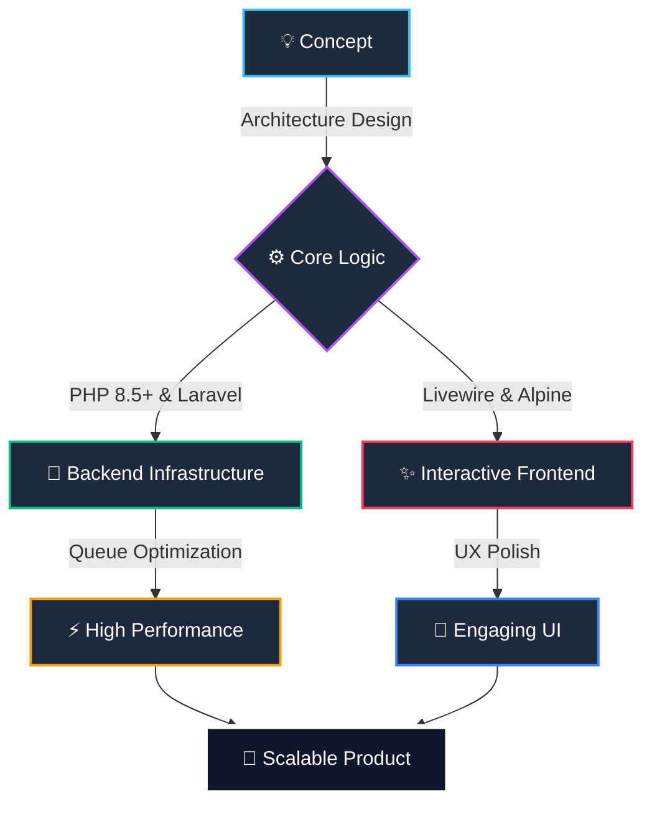

<!-- Hero Section -->

   
  
  
  <h3 style="color: #94a3b8; font-family: 'Outfit', sans-serif; font-weight: 400; letter-spacing: 1px;">
    FULL STACK SOFTWARE ENGINEER
  </h3>

  

    I build systems that <b>scale</b> and interfaces that <b>delight</b>. Specializing in the PHP ecosystem, I bridge the gap between complex backend logic and fluid frontend interactions.
  

  <!-- Socials -->
  

    
    &nbsp;
    
    &nbsp;
    
    &nbsp;
    
  

  
   

---

<!-- The Blueprint Section -->
<h2 align="center">
   
  &nbsp; The Blueprint
</h2>

  

 

---

<!-- Ecosystem Section -->
<h2 align="center">
   
  &nbsp; Open Source Ecosystem
</h2>

A collection of high-performance tools and libraries designed for modern developers.

<table border="0">
  <tr>
    <td width="50%" align="center" valign="top">
      
        
      <b>The Engine for Reliable Workflows.</b> 
      Handle complex state machines and background processes with bulletproof reliability.
        
      
    </td>
    <td width="50%" align="center" valign="top">
      
        
      <b>Advanced PHP Hook System.</b> 
      Async execution, sandboxing, and high-performance event management for PHP 8.5+.
        
      
    </td>
  </tr>
  <tr>
    <td width="50%" align="center" valign="top">
      
        
      <b>Production-Ready Toasts for Livewire.</b> 
      Elegant, performant, and customizable notifications with zero configuration.
        
      
    </td>
    <td width="50%" align="center" valign="top">
      
        
      <b>Modular Architecture for Filament.</b> 
      Seamlessly manage and organize your FilamentPHP admin panels with modularity.
        
      
    </td>
  </tr>
</table>

 

---

<!-- Tech Stack Section -->
<h2 align="center">
   
  &nbsp; The Arsenal
</h2>

|                                    **Backend Mastery**                                    |                                 **Frontend Polish**                                  |                               **Infrastructure & Tools**                               |
| :---------------------------------------------------------------------------------------: | :----------------------------------------------------------------------------------: | :------------------------------------------------------------------------------------: |
|  |  |  |

 

---

<!-- Core Philosophy Section -->
<h2 align="center">
   
  &nbsp; Core Philosophy
</h2>

<table border="0">
  <tr>
    <td width="33%" align="center">
      <h3>🏛️ Architecture First</h3>
      
Solid foundations enable infinite scale. I don't just write code; I design systems that endure.

    </td>
    <td width="33%" align="center">
      <h3>💎 User Obsessed</h3>
      
Every interaction tells a story. I ensure that story is smooth, intuitive, and delightful.

    </td>
    <td width="33%" align="center">
      <h3>⚡ Performance</h3>
      
Speed is the ultimate feature. From database queries to DOM updates, every millisecond counts.

    </td>
  </tr>
</table>

 
 

  

